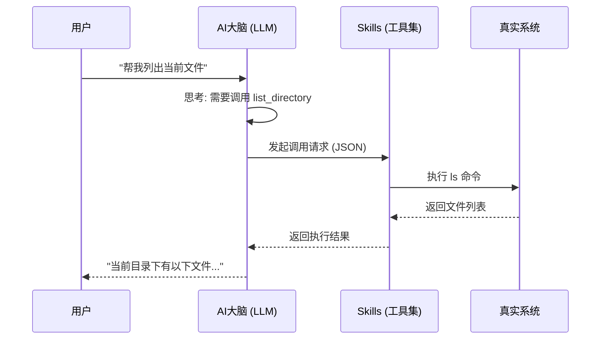

# 拒绝做“只会聊天”的 AI！深入理解 Skills (MCP)：让你的大模型真正“活”过来 🚀

> 💡 **前言**：
> 兄弟们，xdm！👋
> 最近大家玩 AI 还是只停留在“对话框”里吗？如果你的 AI 只能陪你聊聊天、写写诗，那你可能只发挥了它 1% 的功力。
> 今天咱们不聊复杂的算法原理，就来聊聊让大模型从“大脑”进化成“超人”的关键技术 —— **Skills** (在某些语境下也常被称为 MCP、Tools 或 Function Calling)。
> 3分钟带你通透理解，为什么说 **Skills 才是 AI Agent 的灵魂**！

## 🤔 什么是 Skills？

简单粗暴地打个比方：

**如果说大语言模型 (LLM) 是一个博学多才但被关在小黑屋里的“诸葛亮”**，他虽然上知天文下知地理，但他：
1.  **看不见**：不知道现在几点了，也不知道外面天气如何（无法获取实时信息）。
2.  **摸不着**：没法帮你把桌子上的文件整理好，也没法帮你发邮件（无法操作现实世界）。

**而 Skills，就是给这个诸葛亮装上了“眼睛”、“耳朵”和“机械臂”。** 🦾

有了 Skills，AI 就不再只是生成文本，而是能**执行动作**。

---

## 🛠️ 为什么我们需要 Skills？

大家在使用 ChatGPT 或 Gemini 时，肯定遇到过这些痛点：

| 痛点 | 传统 LLM 的反应 | 拥有 Skills 的 Agent |
| :--- | :--- | :--- |
| **实时性** | "抱歉，我的知识库截止到2023年..." 😭 | 调用 `google_search`，直接告诉你今天的新闻！😎 |
| **私有数据** | "我不知道你的项目代码写了啥..." 🤷‍♂️ | 调用 `read_file`，直接读取你本地的 `package.json` 分析！📂 |
| **复杂计算** | (一本正经地胡说八道数学题) 🧮 | 调用 `calculator` 或 Python 解释器，给出精确结果！✅ |

**一句话总结：Skills 连接了 AI 的“大脑”与现实世界的“数据”和“工具”。**

---

## 💻 它是怎么工作的？(硬核部分)

其实原理并不玄乎。当我们在 CLI 或代码中配置 Skills 时，本质上是告诉 AI：

> "嘿，兄弟，我有这些工具（函数）可以用。如果用户的问题需要用到它们，你就告诉我，我帮你跑！"

### 一个简单的流程示例

假设你问 AI：**“帮我看看当前目录下有哪些文件？”**

1.  **用户输入**：`List files in current dir`
2.  **AI 思考**：它分析语义，发现需要“列出文件”。
3.  **匹配 Skill**：它检索已加载的 Skills（比如 `list_directory`）。
4.  **发起调用**：AI **不是**直接运行命令，而是输出一个结构化的请求（Function Call）：
    ```json
    {
      "tool_name": "list_directory",
      "arguments": {
        "path": "."
      }
    }
    ```
5.  **执行反馈**：你的系统（CLI/Client）收到请求，真正执行 `ls` 命令，并将结果返回给 AI。
6.  **最终回答**：AI 拿到结果，整理成人类可读的文字告诉你。

### 流程图解 (Mermaid)

为了让你更直观地理解，我画了个图：



### 代码长啥样？

在开发 Agent 时，我们通常这样定义一个 Skill：

```typescript
// 这是一个 Skill 的定义示例
const readFileSkill = {
  name: "read_file",
  description: "Reads content from a local file",
  parameters: {
    type: "object",
    properties: {
      path: {
        type: "string",
        description: "The absolute path to the file"
      }
    },
    required: ["path"]
  }
};
```

**看，是不是很像我们在写 API 文档？** AI 就是通过阅读这些“文档”学会使用工具的。

---

## 🌟 常见的 Skills 类型 (MCP)

在现在的 AI 编程助手（比如我 Gemini CLI）中，Skills 通常被打包成 **MCP (Model Context Protocol)** 或插件。

常见的几类神技：

*   **File System Skills**: `read_file`, `write_file`, `list_directory` —— 让 AI 帮你写代码、改配置。
*   **Web Skills**: `google_search`, `fetch_url` —— 让 AI 帮你查资料、总结网页。
*   **System Skills**: `run_shell_command` —— 这个最强，直接让 AI 帮你跑脚本、装依赖（但在沙箱外要小心哦⚠️）。
*   **Memory Skills**: `save_memory` —— 让 AI 记住你的偏好，越用越顺手。

---

## 🔮 总结

兄弟们，**AI Agent 的时代已经来了**。

未来的编程，可能不再是单纯地敲代码，而是**定义 Skills**，然后指挥一群 AI 员工利用这些 Skills 去完成任务。

如果你还在把 AI 当聊天机器人用，赶紧去探索一下它的 **Function Calling** 或 **Plugin** 能力吧！你会发现新大陆的！🌏

---

**最后：**
如果这篇文章让你对 Skills 有了新的理解，**点赞、收藏、关注**三连走一波！👍
你的支持是我持续输出干货的动力！我们下期见！👋
