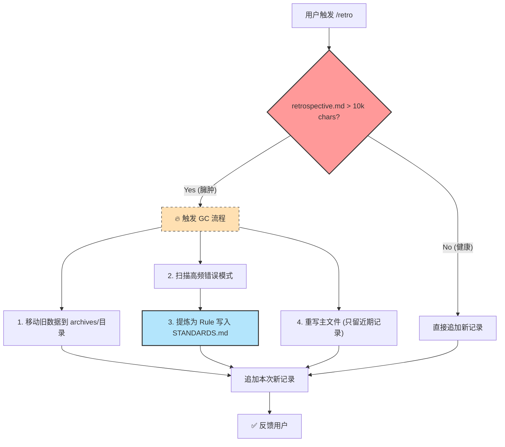

# AI 记忆库炸了？我给 Agent 写了一套“自动垃圾回收”机制 (附 Prompt)


## 🤣 开场暴击：当 AI 记性太好也是种灾难

兄弟们，最近我遇到个特尴尬的事儿。(￣▽￣)"

前段时间我给我的 AI 助手 (Gemini CLI) 装了个**“自动复盘”**技能。这玩意儿本来特好用，每次改完 Bug，它就自动把“踩坑日记”追加到一个叫 `retrospective.md` 的 Markdown 文件里。

一开始我心里美滋滋：**“这下稳了，以后同一个坑绝不踩两次！”** (๑•̀ㅂ•́)و✧

结果跑了半个月，我发现我的 Token 消耗直线上升，响应速度越来越慢。打开那个文件一看……**好家伙！已经堆了快 3 万字了！** 😱

这就好比你大脑里随时随地都在回放你过去 10 年犯过的每一个错误，这谁顶得住啊？而且 Context Window 是有限的，这一大坨陈年旧账直接把我的“CPU”干烧了。

于是我陷入了沉思：**能不能让 AI 像 Java 的 GC (Garbage Collection) 一样，自己管理自己的记忆？** 🤔

## 💡 破局思路：热冷分离 + 智能提炼

既然是 AI 这种高智商生物，当然不能用简单的 `truncate` 截断（太粗暴了，万一把重要经验删了咋办？）。

我设计了一套**“记忆新陈代谢”**协议，核心思想就三点：

1.  **监控 (Monitor)**：每次写入前，先瞅一眼文件大小。
2.  **归档 (Archive)**：太旧的流水账，扔进冷宫（Archive 文件夹），平时不看，考古才看。
3.  **提炼 (Distill)**：最骚的一步！**把高频出现的错误，提炼成“设计原则” (Design Principles)**，写进核心规则库。

简单说就是：**把“经验”变成“直觉”，把“流水账”变成“历史书”。** ✨

### 流程可视化

来，直接上流程图，逻辑一目了然：



## 🛠️ 实操环节：Prompt 怎么写？

Talk is cheap, show me the Prompt. (¬‿¬)

这是我魔改后的 `GEMINI.md` 技能配置，直接抄作业即可！

### 第一步：定义触发器与健康检查

在你的 System Prompt 或技能文件中，加入这个 **Health Check** 逻辑：

```markdown
## 3. 健康检查 (Health Check) - 关键步骤
*   **检查长度**: 每次写入前，估算 `retrospective.md` 内容。如果超过 **10,000 token** (或约 30 条记录)。
*   **执行压缩 (若超标)**:
    1.  **创建归档目录**: 确保 `archives/` 存在。
    2.  **归档**: 将最早的 50% 记录移动到 `archives/retrospective_archive_[YYYY].md`。
    3.  **提炼 (Distill)**: 
        - 检查被归档的记录中是否有重复出现的“模式”。
        - 如果有，将该模式总结为一条简短的“反模式”或“最佳实践”。
        - 追加到 `AI_CODING_STANDARDS.md` 的适当章节。
    4.  **重写**: 更新 `retrospective.md`，仅保留剩余的近期记录。
    5.  **通知**: 告知用户“检测到知识库过大，已自动归档旧记录并提炼了核心规则”。
```

### 第二步：效果演示

现在，当我再次输入 `/retro` 时，奇迹发生了…… ✨

**User**: `/retro` (刚刚修好了一个空指针 Bug)

**AI (内部独白)**:
> 哎呀，记忆文件快爆了 (12k chars)。
> 赶紧看看……以前居然犯过 5 次空指针？
> 得嘞，把这 5 次记录打包扔进 `archives/2024.md`。
> 然后在 `STANDARDS.md` 里加一条死命令：**"严禁在未做 Optional Chaining 的情况下访问深层对象！"**
> 搞定，现在主文件只剩 2k chars 了，清爽！

**AI (回复)**:
> ✅ **自动复盘完成！**
> ⚠️ 检测到记忆库过大，已执行智能清理：
> 1. 旧记录已归档至 `archives/`。
> 2. 基于历史教训，已在开发规范中新增一条规则：**Object Optional Accessing**。

## 🎯 总结

兄弟们，这不仅仅是省 Token 的问题，这是 **AI Agent 自我进化** 的雏形啊！(✪ω✪)

*   **以前**：AI 只是个无情的记录员。
*   **现在**：AI 像个资深架构师，懂得**从历史中总结规律**，并不断优化自己的行为准则。

这才是我们想要的“第二大脑”嘛！建议大家赶紧给自己的 AI 加上这套逻辑，真·降维打击。

---

**今日互动**：
你们的 AI 记忆库一般都存些啥？有没有也被 Token 账单背刺过？评论区聊聊！👇

*(记得点赞收藏，不然下次 Bug 来了又找不到解决方案了 🌚)*
