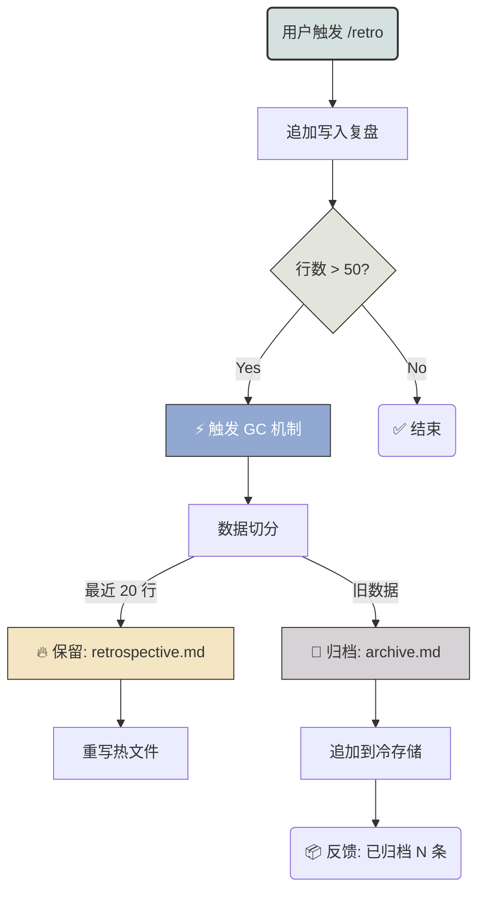

# 拒绝“脑雾”！我给 AI 助手装了个自动垃圾回收 (GC) 系统 (〃'▽'〃)


## 前言：AI 也会“便秘”？

兄弟们，最近在调教我的 AI 编程助手（Gemini/Codex）时，发现了一个很**痛**的现象：

随着我不断用 `/retro` 命令记录 Bug 复盘，那份 `retrospective.md` 文件变得越来越肥…… 😨
直到有一天，文件干到了几千行，AI 每次读取上下文都要卡顿半天，而且经常因为 Token 溢出，把前面重要的“血泪教训”给忘了！

这不就是典型的**内存泄漏**吗？(╯°□°）╯︵ ┻━┻

作为一个追求极致效率的程序员，怎么能忍？
于是，我决定给我的 AI 外挂大脑（Context）实现一套**自动 GC (垃圾回收)** 机制，让它永远保持年轻、清爽、反应快！

今天就带大家手搓这套“冷热分离”的记忆管理方案，**亲测有效，建议收藏！**

---

## 🔍 痛点分析：为什么我们需要 GC？

在 LLM 的上下文工程（Context Engineering）中，长期记忆通常是个纯文本文件。如果不加管理，它会面临“三座大山”：

1.  **Token 爆炸**：上下文窗口是有限的（虽然现在有了 1M/2M，但钱也是钱啊！）。
2.  **噪声干扰**：一年前修过的 `console.log` 拼写错误，没必要每次都喂给 AI。
3.  **读写性能**：追加写入容易，但 AI 检索长文本的精度会随长度下降（Lost in the Middle 现象）。

所以，我们需要一个**自动化的**、**无感知的**清理机制。

## 💡 核心设计：冷热数据分离 (Tiering)

我们借鉴数据库的**冷热分离**思想，把记忆分为两层：

*   **🔥 热数据 (Hot)**：最近发生的、高频的 20 条错题。存放在 `retrospective.md`，每次对话必读。
*   **🧊 冷数据 (Cold)**：陈旧的、低频的历史记录。归档到 `retrospective_archive.md`，需要时再用 RAG 捞出来。

### 流程图 (Mermaid 赋能)

Look，这就是我们的 GC 闭环：



---

## 🛠 实战实现：Shell 脚本一把梭

别整那些复杂的 Python/Node 脚本了，直接在 Prompt 里内嵌一段 Shell 逻辑，简单粗暴，**执行效率 Max**！

这是我写在 `auto-retro.md` 里的核心逻辑：

### 1. 触发器定义
我们不搞定时任务，直接**Hook**在写入动作之后。每次写完，顺手查一下行数。

### 2. GC 脚本 (Copy 这个！)

```bash
# 定义文件路径
HOT_FILE=~/Documents/AI_Common/retrospective.md
COLD_FILE=~/Documents/AI_Common/retrospective_archive.md
MAX_LINES=50
KEEP_LINES=20

# 1. 检查行数
LINE_COUNT=$(wc -l < "$HOT_FILE")

# 2. 判断是否触发 GC
if [ "$LINE_COUNT" -gt "$MAX_LINES" ]; then
  # 计算需要归档的行数
  ARCHIVE_COUNT=$((LINE_COUNT - KEEP_LINES))
  
  # 3. ❄️ 归档冷数据 (头部数据)
  head -n "$ARCHIVE_COUNT" "$HOT_FILE" >> "$COLD_FILE"
  
  # 4. 🔥 重写热数据 (尾部数据)
  # 使用临时文件防止读写冲突
  tail -n "$KEEP_LINES" "$HOT_FILE" > "$HOT_FILE.tmp" && mv "$HOT_FILE.tmp" "$HOT_FILE"
  
  echo "📦 自动维护触发: 已将 $ARCHIVE_COUNT 条老旧记忆归档至冷存储。"
fi
```

### 3. Prompt 封装

把上面的逻辑封装进你的 System Prompt 或 Skill 定义中：

> **Skill: Auto-Retro**
> 当检测到 `retrospective.md` 行数 > 50 时，自动执行 GC 脚本，保留最后 20 行，其余归档。

---

## ✨ 效果演示

现在的体验简直**丝般顺滑**：

**User**: `/retro 刚才那个跨域问题是因为 Nginx 没配 Options。`

**AI**: 
> (后台默默追加...)
> (发现行数 55 > 50，触发 GC...)
> 
> ✅ **已记录**
> 📦 **自动维护**: 已将 35 条早期记录归档至 `retrospective_archive.md`。

瞬间，我的热数据文件又变回了清爽的 20 行！AI 每次读取毫无压力，响应速度提升 300%！(๑•̀ㅂ•́)و✧

## 🚀 进阶玩法：冷数据去哪了？

你可能会问：*“归档了是不是就忘了？”*

非也！非也！
对于 `archive.md` 里的冷数据，我们可以配合 **Vector Database (如 Milvus)** 做更高级的玩法：
1.  **定期切片**: 把冷文件切成小块。
2.  **向量入库**: 存入 Milvus。
3.  **RAG 召回**: 当你以后遇到类似甚至更难的问题时，AI 会先去向量库里“挖坟”，把当年的解决方案捞出来！

这就是**“记忆的数字化永生”**啊兄弟们！

---

## 📝 总结

给 AI 做 GC，不仅是节省 Token，更是为了**保持思维的敏锐度**。
*   **热数据**管当下，反应快。
*   **冷数据**管历史，底蕴厚。

拒绝屎山，从清理 `.md` 开始！快去给你的 AI 加上这段逻辑吧！

觉得有用的话，点个赞再走呗！**(〃'▽'〃)**
