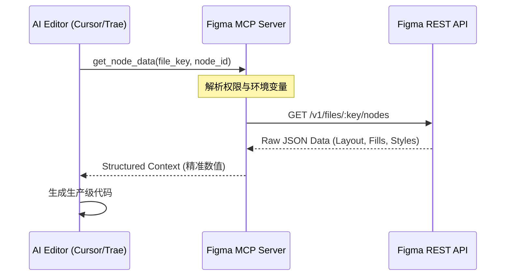

# 深度实战：将 Figma 接入编辑器的正确姿势 —— 基于 MCP 协议的自动化 UI 开发指南 🚀


## 1. 痛点：为什么你的 AI 写不准 UI 代码？ (๑•̀ㅂ•́)و✧

很多开发者在用 Cursor 或 Trae 时会发现一个尴尬的现象：AI 虽然能“看图说话”，但生成的 CSS 往往只是“形似”。
- **精度缺失**：阴影的模糊半径、Flex 布局的具体比例，靠视觉识别总有 2-3px 的误差。
- **色彩偏差**：复杂渐变（Gradient）的精确色标，截图往往会丢失色偏细节。

这就是为什么我们需要 **Figma Developer MCP**：它将 AI 的工作模式从“模糊的视觉猜测”升级为了“精确的数据驱动”。

---

## 2. 原理剖析：MCP 协议如何打通设计与代码？

**Model Context Protocol (MCP)** 不仅仅是一个接口，它是一层标准化的“中间件”。



通过 MCP，AI 可以直接访问 Figma 的 **Rest API**，读取节点树中的原始数据。这意味着它拿到的不是“像素点”，而是 `GRADIENT_LINEAR` 的角度和 `border-radius` 的精确值。

---

## 3. 生产级配置全攻略

### 3.1 钥匙：FIGMA_API_KEY 的获取

1.  **路径**：登录 Figma -> Account Settings -> Security 选项卡。
2.  **生成**：在 `Personal access tokens` 下创建新 Token。
3.  **安全原则**：建议在 Token 权限中仅勾选 `File content` 的只读权限，遵循**最小权限原则 (Least Privilege)**，保护你的账号资产。

### 3.2 注入：编辑器配置

在 **Cursor** 的 `mcpServers` 或 **本地 Agent** 的 `config.json` 中，填入以下配置：

```json
{
  "mcpServers": {
    "figma-bridge": {
      "command": "npx",
      "args": ["-y", "figma-developer-mcp", "--stdio"],
      "env": {
        "FIGMA_API_KEY": "YOUR_FIGMA_API_KEY_HERE"
      }
    }
  }
}
```

**💡 为什么一定要用 npx？**
`npx` 能确保你始终运行的是社区最新的逻辑转换引擎，无需手动全局安装 `npm install -g`，避免了版本落后导致的 API 适配问题。

---

## 4. 核心避坑：解决 AI 无法读取文件的问题

如果你在接入后遇到 `Permission Denied`，通常是因为你直接发了 **Figma Community (社区)** 的原始链接。

**硬核技巧 (必看)**：
- **Duplicate (复制副本)**：点击 Figma 页面右上角的 "Duplicate" 按钮。
- **权限流转**：将文件复制到你自己的 **Drafts (草稿箱)**。
- **新 File Key**：复制后的文件拥有独立的 ID，此时 AI 才能通过你的 API Key 拥有完整的树遍历权限。

---

## 5. 总结：从“切图仔”向“语义工程师”进阶

接入 Figma MCP 后，你的开发流程将从“换算像素”进化为“微调语义”。

如果你在配置过程中遇到 `npx` 权限报错（通常是 EACCES），请检查你的 `npm config get prefix` 路径权限。

**技术不只是用来欣赏的，更是用来跑通的。还没配好的兄弟，现在就动起来！** (๑•̀ㅂ•́)و✧

---
