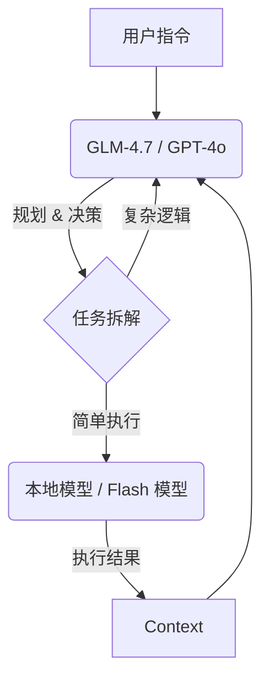

# Token 账单爆炸？程序员必须要懂的大模型计费工程学 (实战指南)


## 0. 写在前面

你是否遇到过这种情况：
写了一个简单的 Python 脚本调用 API，本来以为只会花几毛钱，结果第二天起床一看，账单扣了十几刀？
或者在使用 Playwright 做自动化测试时，明明没跑几次，Token 消耗却像坐了火箭？

**这不只是“贵”的问题，这是“工程架构”出了问题。**

本文不聊虚的，只聊干货：**从底层计费逻辑到生产级 Agent 架构，如何帮你的 AI 应用“止血”并提升效率。**

---

## 1. 重新认识 Token：它不是按“字数”算的

很多开发者对 Token 的理解停留在“输入+输出”。
**错。** 在 Agent 和自动化场景下，Token 的真实公式是：

$$ Cost = \sum (System + Schema + History + Context + Output) $$

### 这里的坑在哪里？

1.  **History (上下文)**：这是最大的隐形刺客。你以为你只发了一句 "Continue"，但 AI 其实重新阅读了前 10 轮的所有对话。**每一轮交互，历史 Token 都会被重复计费。**
2.  **Schema (工具定义)**：如果你接入了 MCP (Model Context Protocol) 或者定义了 20 个 Function Call，这些 JSON Schema 在**每一次**调用时都会被算作 Input Token。
3.  **Context (环境)**：在 Playwright 自动化中，把整个 `document.body.innerText` 喂给 AI？恭喜你，一次页面决策可能就是 10k+ Tokens。

---

## 2. 为什么 Agent 尤其烧钱？

让我们看一个真实的 Playwright 自动化任务数据：

| 步骤 | System Prompt | 历史上下文 | 页面 DOM 数据 | AI 输出 | 单步消耗 |
| :--- | :--- | :--- | :--- | :--- | :--- |
| Step 1 | 2k | 0 | 5k | 0.5k | **7.5k** |
| Step 5 | 2k | 10k (累积) | 5k | 0.5k | **17.5k** |
| Step 10| 2k | 25k (累积) | 5k | 0.5k | **32.5k** |

**跑完一个 10 步的流程，总消耗可能轻松突破 200k Tokens。**
按 GPT-4o 的价格，跑一次流程就是几块钱人民币。调试 50 次，几百块就没了。

---

## 3. 生产级实战：如何降本增效？

我们不需要“省吃俭用”，我们需要的是**架构优化**。

### 策略一：两阶段上下文 (The Two-Phase Context)

❌ **错误做法**：每次都把整个项目代码喂给 AI。
✅ **正确做法**：**Map (索引) + Lazy Load (按需加载)**。

1.  **初始化阶段**：让 AI 读一遍全量代码，生成一个 `PROJECT_SUMMARY.md`。
    *   *Cost*: High (一次性)
    *   *Content*: 目录结构、核心类名、文件职责。
2.  **日常开发阶段**：Prompt 只包含 `PROJECT_SUMMARY.md` + 你正在修改的那个文件。
    *   *Cost*: Very Low (持续性)

### 策略二：大脑与肌肉分离 (Brain & Muscle)

不要用 GLM-4.7 / GPT-4o 去做“格式化 JSON”或者“写简单的 boilerplate”这种脏活累活。



*   **Brain (高智商)**：负责 Playwright 的页面分析、逻辑判断、异常处理。
*   **Muscle (低成本)**：负责日志清洗、简单代码生成、文本摘要。

### 策略三：DOM 树瘦身 (HTML Minification)

在自动化测试中，**严禁**直接投喂 `document.html()`。

请使用以下算法清洗 DOM：
1.  移除所有 `<script>`, `<style>`, `<svg>`, `<path>` 标签。
2.  移除所有空节点。
3.  只保留关键属性 (id, name, class, role, aria-label)。
4.  将过长的文本截断。

**收益：Token 消耗通常能降低 70%-90%。**

---

## 4. 硬核配置：Token 护栏

在生产环境，必须给 Agent 加上“紧箍咒”。

```typescript
// types/agent.d.ts

interface AgentConfig {
  model: string;
  // 1. 强制总 Token 上限，防止死循环
  maxTotalTokens: number; 
  // 2. 限制最大轮数 (TTL)
  maxSteps: number;
  // 3. 动态上下文窗口：超过 10 轮自动总结前 5 轮
  contextWindowStrategy: 'sliding' | 'summarize';
}

const PRODUCTION_CONFIG: AgentConfig = {
  model: 'glm-4-plus',
  maxTotalTokens: 100000, // 熔断阈值
  maxSteps: 15,           // 防止 AI 在页面上反复横跳
  contextWindowStrategy: 'summarize'
};
```

---

## 5. 避坑指南 (Pitfalls)

1.  **不要在 System Prompt 里写巨长的 Few-Shot 示例**。如果示例很长，请通过 RAG (检索增强生成) 动态插入，而不是硬编码。
2.  **警惕 `console.log`**。如果你的 Agent 会读取终端输出，千万别让 Webpack/Vite 打印几千行的构建日志，这会瞬间爆满 Context Window。
3.  **流式输出不省钱**。Streaming 只是为了用户体验（TTFT），对 Total Token 计费没有任何影响。

---

## 6. 总结

购买大模型服务，不仅是买“算力”，更是考验你的“工程力”。

*   **能用 Diff 绝不全量。**
*   **能用 3.5/Flash 绝不用 4.0。**
*   **永远给 Agent 设上限。**

记住：**Token 是耗材，不是资产。用最少的 Token 解决最难的问题，才是高级工程师的价值所在。**

---
*本文遵循 [Juejin Writer 规范] 生成*
