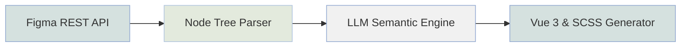

# 别再手敲 UI 了！我把 Figma 直接“喂”给了代码编辑器，开发效率原地起飞 🚀


## 前言：前端开发者的“1px 噩梦” (๑•̀ㅂ•́)و✧

兄弟们，你们是否也经历过这种痛苦：
- UI 给了一个酷炫的渐变背景，你得一个参数一个参数对着调。
- 设计稿是 1920px，你得手动算各种响应式 Flex 比例。
- 甚至... UI 小姐姐改了个圆角，你得翻遍几百个组件去搜 `border-radius`。

这哪是写代码，这简直是在玩“大家来找茬”！作为一名优雅（懒惰）的前端专家，我决定：**这种苦，再也不吃了！** (〃'▽'〃)

今天就带大家看看，我如何直接把 Figma “喂”给代码编辑器，实现从设计稿到 Vue 3 组件的“降维打击”！

---

## 核心链路：AI 它是怎么“看懂”设计稿的？

其实原理并不神秘，但逻辑必须丝滑。我们构建了一套基于 AI 的“视觉识别与语义映射”闭环：



### 1. 节点提取 (Extraction)
通过 Figma API 拿到的不是图片，而是结构化的 JSON。比如我们刚才解析的 **Gemini AI Landing Page**：
- 它会告诉你：这是一个 `FRAME`，布局模式是 `layout_ZPL96R`。
- 填充色是 `GRADIENT_LINEAR`（线性渐变），甚至连色偏角度都清清楚楚。

### 2. 语义转换 (Semantic Mapping)
这一步最关键！AI 不只是翻译代码，它得“理解”组件。
- 它能识别出 `Chat with Gemini` 加一个 `arrow_forward` 图标就是一个典型的 **Primary Button**。
- 它会自动匹配我们项目现有的主题变量（如 `--primary-color`）。

---

## 实战演示：Gemini 风格的渐变标题动画

就在刚才，我让 AI 读了一个 Gemini 的社区作品。
**设计需求**：一个带流动渐变的文本标题。

### AI 生成的“优雅”代码：
```vue
<template>
  <div class="gemini-hero">
    <h1 class="gradient-text">Welcome to the Gemini era</h1>
  </div>
</template>

<style lang="scss" scoped>
.gradient-text {
  background: linear-gradient(
    74deg, 
    #439DDF 12%, 
    #4F87ED 38%, 
    #9476C5 51%, 
    #D6645D 62%
  );
  background-size: 200% auto;
  -webkit-background-clip: text;
  background-clip: text;
  color: transparent;
  animation: shine 5s linear infinite;
}

@keyframes shine {
  to { background-position: 200% center; }
}
</style>
```
不需要我手调一个颜色，AI 直接根据 `fills` 里的 `GRADIENT_LINEAR` 转换成了完美的 CSS 动画。这波操作，我给满分！(๑•̀ㅂ•́)و✧

---

## 灵魂准则：项目主题优先，莫兰迪色补位

为了防止生成的代码跟屎山一样难维护，我们给 AI 设定了一套 **“外部大脑”设计原则**：

1.  **项目主题色优先**：只要项目里定义了 `--primary-color`，AI 就绝对不准乱写十六进制。
2.  **莫兰迪色补位**：如果设计稿里有些非功能性图标（比如装饰用的光晕），在项目里找不到对应的变量，那就直接开启“莫兰迪色系”模式，确保视觉的高级感和克制。

这种“有迹可循”的自动化，才是真正的赋能！

---

## 结语：前端以后不需要写 UI 了？

当然不是。AI 替代的是重复性的“搬砖”劳动，让我们能腾出手来去思考 **架构设计、状态流转和极致的用户体验**。

告别切图，拥抱 AI，这不仅是生产力的解放，更是对前端职能的重新定义。

**大家觉得 Figma 到代码的距离还有多远？欢迎在评论区留言battle！** (๑•̀ㅂ•́)و✧
