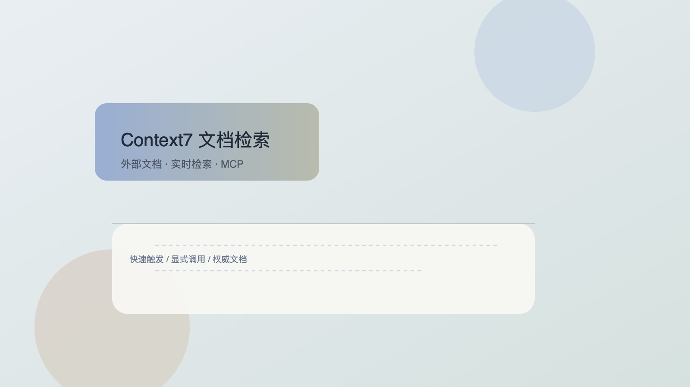
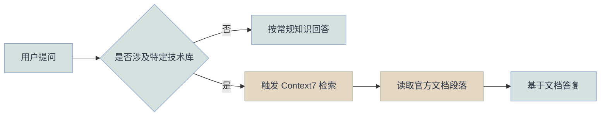

# Context7 使用指南（MCP 文档检索）



## 背景
团队在使用 AI 协作时，常遇到“知识过期或不确定”的问题。Context7 作为 MCP 协议下的文档检索工具，能让 AI 实时查阅官方文档，降低错误率。

入口：https://context7.com/

## 目标

- 说明 Context7 的定位与价值
- 给出自动触发与显式调用的标准方式
- 提供可复用的提示语与验证方法

## 核心内容
### 1. Context7 是什么
Context7 是一个基于 MCP 的文档检索工具，核心作用是让 AI 实时查阅第三方技术文档（如 Next.js、Tailwind、Supabase、Stripe 等）。你只需要自然提问，检索动作由 AI 自动完成。

### 2. 两种触发方式
**自动触发（Implicit）**
- 当问题涉及特定技术库，且需要最新/权威信息时自动触发
- 适合“我不确定版本/细节”的问题

**显式调用（Explicit）**
- 当你希望强制检索时，在提问中加入“查文档 / Context7”
- 适合“必须基于最新文档回答”的场景

### 3. 检索流程（示意）


### 4. 支持的文档源（示例）

- 前端：Next.js、Vue、React、Tailwind CSS、Shadcn UI
- 后端/数据库：Supabase、Prisma、Drizzle、MongoDB
- 工具：Stripe、Vercel、OpenAI SDK、LangChain

### 5. 验证是否检索
若团队遵循协议，AI 回复中会出现来源标记（如 `[L2: Context7]`）提示已检索。

## 代码示例
```text
帮我查一下 Upstash Redis 的 zadd 方法参数，用 Context7 查。
```

## 常用提问示例
- “在 Next.js 14 中怎么配置 Server Actions？请查文档。”
- “Tailwind 里设置 grid 布局的类名有哪些？用 Context7 检索。”
- “Supabase 的 Auth 模块如何在服务端获取 User？基于最新文档。”

## 总结
Context7 可以理解为“内置在聊天框里的技术文档检索器”。当你需要最新、权威、可追溯的技术答案时，优先触发或显式调用它。

## 参考资源
- Context7（MCP 文档检索工具）
